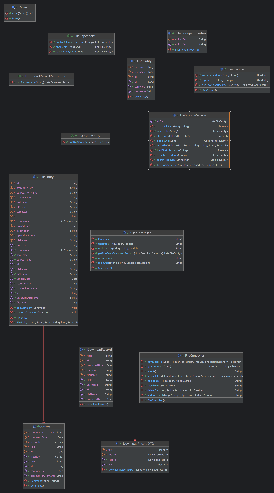

# Jsaiting|白鲸大学课程文件管理系统

## 目前的使用方法
在IDEA上运行mian.java这个文件，然后可以直接在本地打开 http://localhost:8080/ 即可打开我们构架的前端平台。

我们已经将本项目部署在网上，通过校园网访问 10.129.240.179:8080 即可访问我们托管的前端页面。

## 项目介绍

白鲸大学的同学们对于课程的学习总是精益求精的，一个好的文件管理和共享平台对于提高我们的学习效率。我们借鉴了PKUHUB这个网页的想法，并添加了文件评论等更加有意义的功能。

Jsaiting是一个基于Spring Boot开发的文件上传与下载系统，旨在提供一个简单、高效的文件共享平台。用户可以上传各类文件，添加详细描述信息，并按照课程、教师、学期等信息进行分类。系统支持文件搜索、下载记录追踪以及文件评论功能，为用户提供完整的文件管理体验。

## 主要功能

- 用户管理：用户注册与登录、个人上传历史查看、个人下载记录查看
- 文件管理：文件上传（支持添加详细描述、课程信息等元数据）、文件搜索（支持按文件名、描述、课程名等多维度搜索）、文件下载（自动记录下载历史）、文件删除（仅允许删除自己上传的文件）
- 评论系统：为文件添加评论、查看文件的所有评论

## 使用的技术概况

### 后端技术
- **Spring Boot 3.0.6**: 应用框架
- **Spring MVC**: Web层框架
- **Spring Data JPA**: 数据访问层框架
- **H2 Database**: 内存数据库
- **Thymeleaf**: 服务器端模板引擎
- **Lombok**: 简化Java代码

### 前端技术
- **HTML/CSS/JavaScript**: 基础前端技术
- **Thymeleaf模板**: 与Spring Boot集成的模板引擎

## 系统架构

### 分层架构

项目采用经典的MVC分层架构：

1. **控制层(Controller)**: 处理HTTP请求，调用服务层完成业务逻辑
   - `FileController`: 处理文件上传、下载、搜索等请求
   - `UserController`: 处理用户注册、登录等请求

2. **服务层(Service)**: 实现业务逻辑
   - `FileStorageService`: 文件存储、检索服务
   - `UserService`: 用户认证、注册服务

3. **数据访问层(Repository)**: 与数据库交互
   - `FileRepository`: 文件数据访问
   - `UserRepository`: 用户数据访问
   - `DownloadRecordRepository`: 下载记录数据访问

4. **模型层(Model)**: 数据实体
   - `FileEntity`: 文件实体，包含文件信息和评论内部类
   - `UserEntity`: 用户实体
   - `DownloadRecord`: 下载记录实体

### 配置
- `FileStorageProperties`: 文件存储配置，指定上传目录

## 类图

## 主要类及方法

### 控制器(Controller)

#### FileController
- `homepage()`: 显示主页和文件列表
- `uploadFile()`: 处理文件上传
- `downloadFile()`: 处理文件下载并记录
- `searchFiles()`: 搜索文件
- `deleteFile()`: 删除文件
- `addComment()`: 添加文件评论
- `getComments()`: 获取文件评论

#### UserController
- `loginUser()`: 用户登录
- `registerUser()`: 用户注册
- `userPage()`: 显示用户个人页面，包含上传和下载历史

### 服务(Service)

#### FileStorageService
- `storeFile()`: 存储上传的文件
- `loadFileAsResource()`: 加载文件为资源
- `getAllFiles()`: 获取所有文件
- `searchFiles()`: 搜索文件
- `getFileById()`: 通过ID获取文件
- `deleteFileById()`: 通过ID删除文件

#### UserService
- `registerUser()`: 注册新用户
- `authenticateUser()`: 验证用户登录
- `getDownloadRecords()`: 获取用户下载记录

### 数据实体(Entity)

#### FileEntity
- 存储文件信息：文件名、类型、描述、路径、大小等
- 包含课程信息：课程名称、教师、学期等
- 内部类`Comment`：存储文件评论

#### UserEntity
- 存储用户信息：用户名、密码

#### DownloadRecord
- 记录下载信息：文件ID、用户名、下载时间、文件名

### 数据访问(Repository)

#### FileRepository
- `searchByKeyword()`: 通过关键词搜索文件
- `findByUploaderUsername()`: 查找用户上传的文件
- `findByIdIn()`: 通过ID列表查找文件

#### UserRepository
- `findByUsername()`: 通过用户名查找用户

#### DownloadRecordRepository
- `findByUsername()`: 查找用户的下载记录

## 总结

Jsaiting是一个功能完整的文件管理系统，通过Spring Boot框架实现了文件上传、下载、搜索、评论等核心功能。系统采用分层架构设计，代码结构清晰，易于维护和扩展。通过整合Spring Data JPA和H2数据库，实现了高效的数据存储和检索。